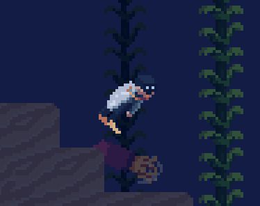
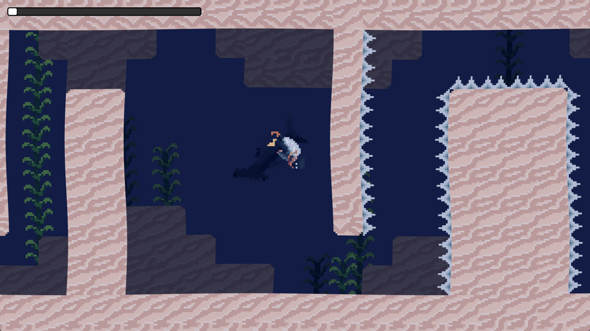
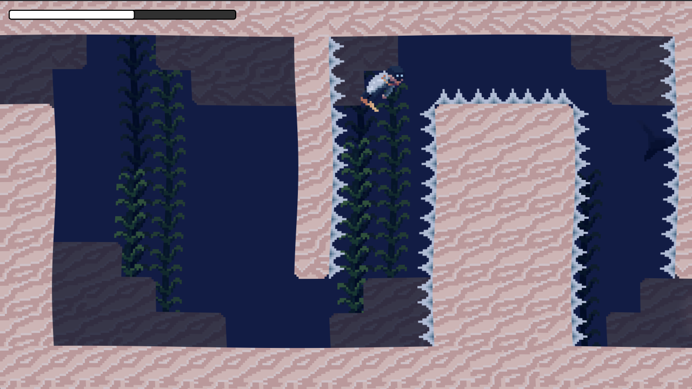
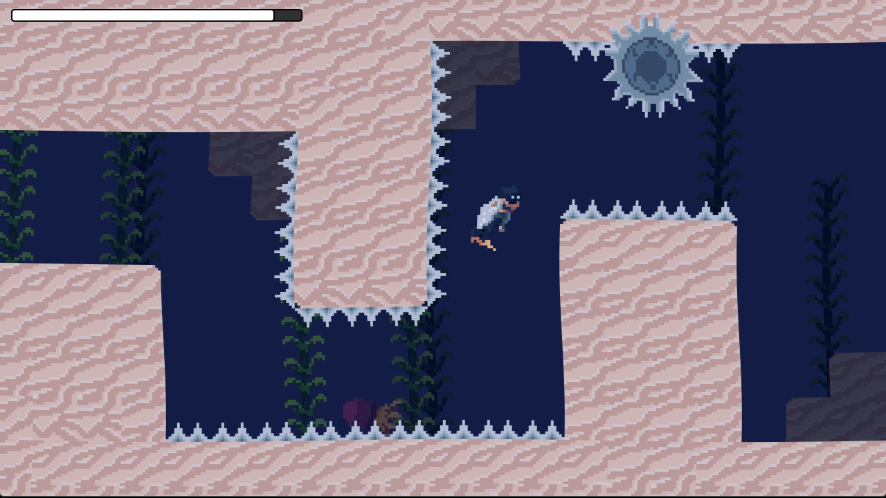

# Ticking Ocean
**Play as a diver and avoid obstacles before your oxygen runs out!**

A short game with three levels made for [Queble's Game Jam 2026](https://itch.io/jam/quebles-jam-2026). The main theme was "Out of Place".

**Try it out on [itch.io](https://sayuo.itch.io/ticking-ocean)!**

## How to Play
- **Arrow Keys** -> Rotate the player to change direction
- **Space** -> Take a small boost to swim
- **Shift** -> Dash (Consumes oxygen!)

## Screenshots

## External Shaders
- **[Retro Fade 2D](https://godotshaders.com/shader/retro-fade-2d/) (Under the MIT License)**
- **[Sine Wave Camera View](https://godotshaders.com/shader/sine-wave-camera-view-shader/) (Under the CC0 License)**

## License
- **This project is under the MIT License. See [LICENSE](LICENSE) for details.**

## Developers
- **[sayuo](https://github.com/sayuo4/) - Main game programming and core gameplay systems**
- **[Zaid](https://github.com/Zaid-mohamed) - Art and game programming**
